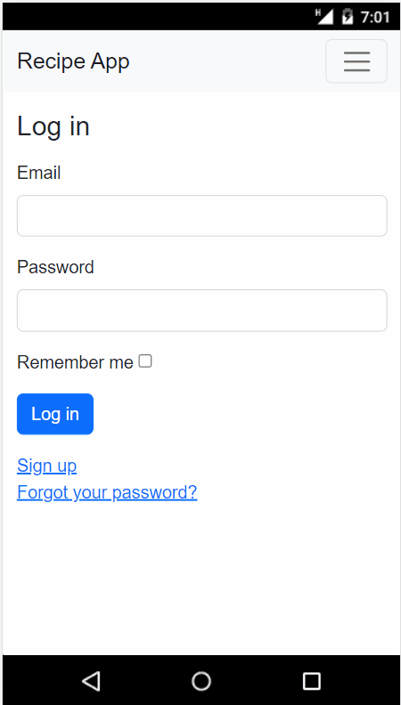

# Recipe App 

> Recipe App is a web application that allows users to create, and manage recipes, foods, and ingredients.

## Built With 

- Ruby
- Ruby On Rails
- PostgreSQL
- Redis
- Bootstrap

## Demo   

For a live demo visit [here](https://thawing-bastion-63884.herokuapp.com/) (if available)

## Getting Started

To get a local copy up and running follow these simple example steps

### Prerequisites 📌
- `Ruby`
- `Ruby on Rails` 
- `PostgreSQL`   
- `Redis`
### Setup 🔂 
- Clone the repository using this [GitHub](git@github.com:VicPeralta/Recipe-App.git) link
- `cd` into the directory
### Install ⚙️
- Run `bundle install` && `npm install`

### Database 💾
- Run `rails db:create` to create the database
- Run `rails db:migrate` to create the tables
### Usage 💻
- Run `rails s` to start the server

- ## Authors

👤 **Mateo Villagómez**

- GitHub: [mateo951](https://github.com/mateo951)
- Twitter: [MVGameDev](https://twitter.com/MVGameDev)
- LinkedIn: [mateo-villagómez](https://linkedin.com/in/mateo-villagómez/)

👤 **Victor Peralta**

- GitHub: [Victor Peralta](https://github.com/VicPeralta)
- Twitter: [Victor Peralta](https://twitter.com/VicPeralta)
- LinkedIn: [Victor Peralta](https://www.linkedin.com/in/vicperalta/)

## 🤝 Contributing

Contributions, issues, and feature requests are welcome!

Feel free to check the [issues page](../../issues/).

## Show your support

Give a ⭐️ if you like this project!

## Acknowledgments

- Hat tip to anyone whose code was used
- Inspiration
- etc

## 📝 License

This project is [MIT](./LICENSE) licensed.
